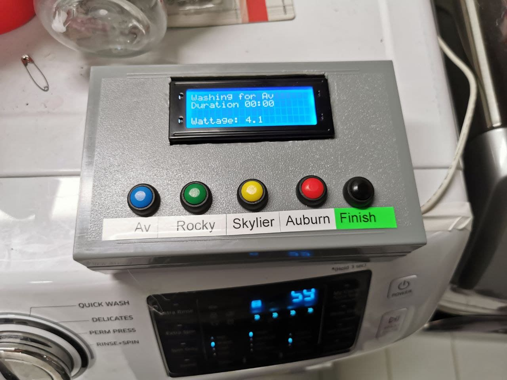
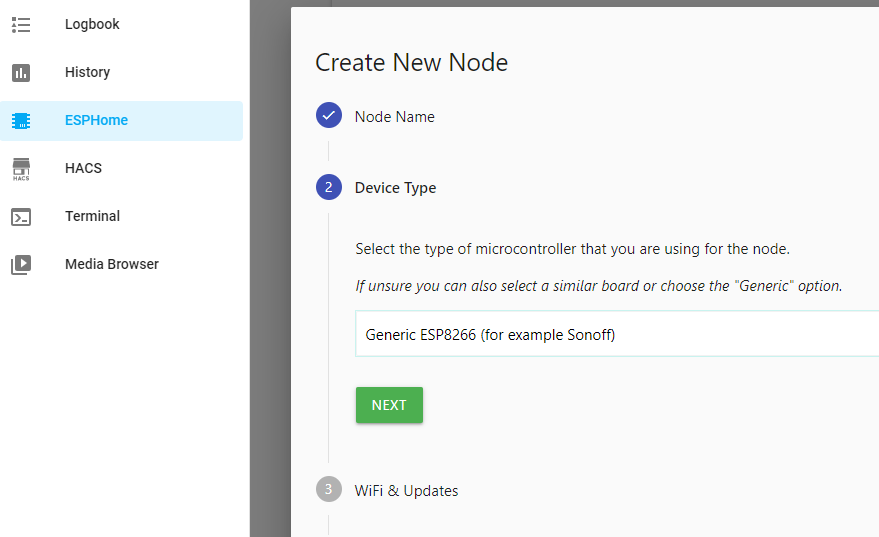
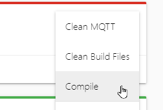
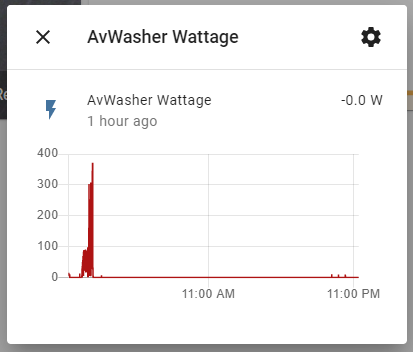
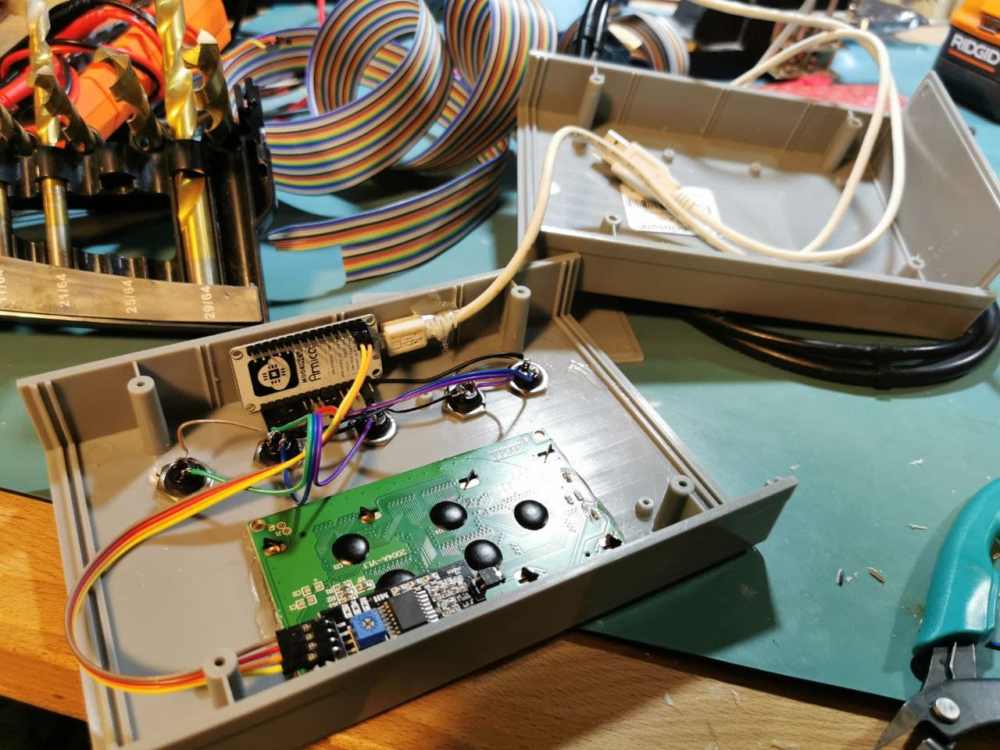
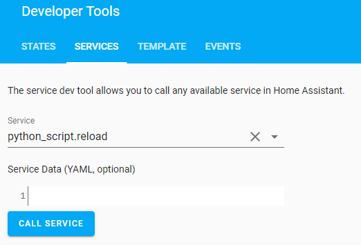
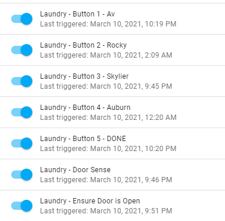
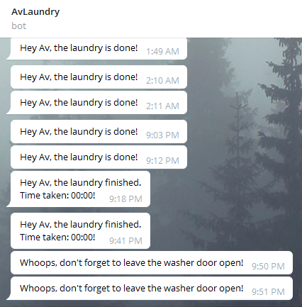
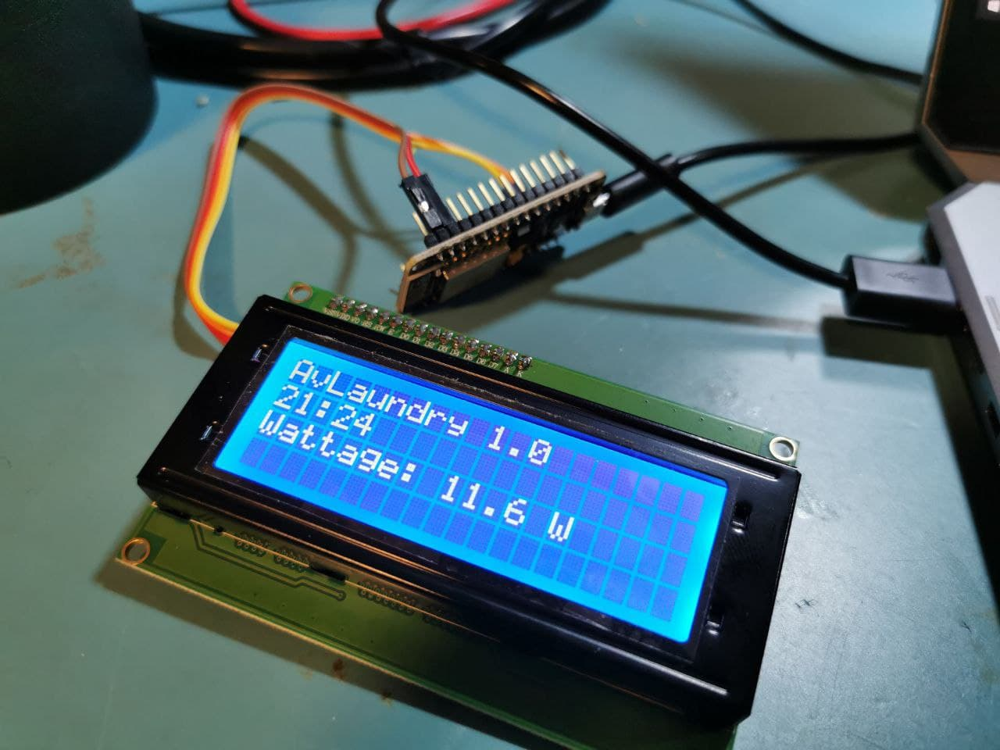

# Av's Laundry Bot
Using Home Assistant, a wifi plug, an ESP, a telegram bot, and some python scripts to 
automatically notify the occupants of the home when the laundry is done.



## Features 
- Monitor the washing machine until it finishes the cycle
- Send Telegram alerts to the person that started the wash cycle
- Repeat the alerts until the washer door is opened
- Warn if the washer door is closed after a cycle (the door should stay open to prevent mildew)

## Requirements 

- Home Assistant
- ESPHome installed as an Add-On to Home Assistant
- An ESP8266-based wifi plug with energy monitoring. I used [this one](https://www.amazon.ca/gp/product/B07D8ZVJN2/ref=ppx_yo_dt_b_asin_title_o01_s00?ie=UTF8&psc=1).
- Another ESP8266 development board for the control panel
- Character LCD display with an i2c interface, such as [this one](https://www.amazon.ca/gp/product/B07TXGD3WS/ref=ppx_yo_dt_b_asin_title_o01_s00?ie=UTF8&psc=1).
- Magnetic reed sensor to read the door position
- [ESPSense](https://github.com/cbpowell/ESPSense) library

## Getting Started 

### 1. Convert the Smart Plug
The wifi smart plug will be designed to work with Tuya/Smart Life out of the box.  
We will convert this to use ESPHome.

1. Create a new device in ESPHome.  Give it a good name, and just select 'Generic ESP8266' for the type.
   
1. Configure your wifi credentials.
1. Finish the configuration and wait for it to build.
1. Download the binary file. Click the hamburger menu next to your ESPHome node and select Compile.
   
1. Click 'Download Binary' and save the .bin file.

1. Using a laptop running Linux with wifi, follow the steps here: [tuya-convert](https://github.com/ct-Open-Source/tuya-convert)  
   You'll be using tuya-convert to install this custom firmware on your smart plug.
   You'll only need to do this once -- future updates will be done directly from ESPHome via an OTA update.
   Make sure to place your .bin file into the 'files' directory after installing but before running tuya-convert, 
   and select this .bin.
   
1. If you did everything correctly, the Node will turn green in ESPHome and you should be able to see logs from it.
   
### 2. Prepare the ESPHome configuration for the smart plug
1. You'll need a way to place files on the Home Assistant configuration.  You can use SSH or the File Browser add-on.
1. Place the [espsense.h](esphome/espsense.h) file in the 'config/esphome' directory.
1. Select the plug node you created earlier, and click 'Edit'. Replace the configuration with the plug configuration from [this file](esphome/plug.yaml).
1. Change your wifi SSID and the name of the plug to the one from the earlier config. 
1. Click 'Upload'.  The new configuration will be compiled and uploaded to your smart plug.
1. Switch to the 'Integrations' section in Home Assistant.  There will now be a new option to add a new integration with the name of your smart plug.
1. You should now see the smart plug available in Home Assistant.  Try turning it on and off!
   
1. Plug your washing machine into this plug.  
   My washer uses 0W when it is off and after the wash cycle completes, yours may be different.   


### 3. Prepare the Control Panel ESP
1. Add another node to ESPHome.  I am using a NodeMCU ESP8266, so I selected this as the type.
1. Edit the configuration to match [this file](esphome/controlpanel.yaml)
1. Compile the script and download the .bin file.
1. I used the [NodeMCU Flash Tool](https://github.com/nodemcu/nodemcu-flasher) to flash this .bin onto my ESP. 
   You'll only need to do this once -- future updates are done via OTA.
   
### 4. Wire up the control panel

I wired the buttons as follows:

**LCD Character Display**
- `GND > GND pin`
- `VCC > Vin pin`
- `SDA > D2`
- `SCL > D1`

**Buttons**
- `Button 1 > D0`
- `Button 2 > D3`
- `Button 3 > D4`
- `Button 4 > D6`
- `Button 5 > D7`
- `Door Sensor > pin 10` (not pictured)

Wire the other side of each button to GND.  Pressing the button will 'pull down' the data pin to ground.



### 4. Create the Helper entities

I'm using Helper entities in Home Assistant to store the state of the laundry system, such as who started the wash, etc.
These can be found under `Configuration > Helpers`.

| Name        | Entity ID           | Type  |
| ------------- |-------------| -----|
| LaundryDone | input_boolean.laundrydone  | Toggle |
| LaundryInUse |input_boolean.laundryinuse |Toggle |
| LaundryLine1 |input_text.laundryline1 | Text |
| LaundryLine2 | input_text.laundryline2 |Text |
| LaundryLine3 |input_text.laundryline3 |Text |
| LaundryLine4 |input_text.laundryline4 |Text |
| laundrystartedat |input_datetime.laundrystartedat |Date and/or time |
| LaundryUser |input_text.laundryuser |Text |
| LaundryZeroCount |input_number.laundryzerocount |Number |

At this point, when you change the value of Laundry Line 1, the updated text should appear on your LCD display within a second.

### 5. Prepare the Python Scripts

1. To use Python Scripts, you'll need to enable them.  Edit the `configuration.yaml` file and add this line:
   
   ```
   python_script:
   ```
   
   That's it!  **Important:** Restart Home Assistant.

1. Create a directory at `config/python_scripts`

1. Copy the files from the [python_scripts](python_scripts) directory into there.
1. Modify the files to match the entity IDs you created earlier, specifically for your plug, which is probably not called 'avwasher'.
1. Use the `Developer Tools` page in Home Assistant to perform a `python_script.reload` service call.  This will refresh all the scripts.
      

You can test if your python scripts are working by performing a python_script.start_laundry service call.  
You should see the name appear on the LCD screen.

### 6. Prepare the Automations

These automations cause the button presses to trigger the python scripts.
You can use the Home Assistant UI to create these, but I've included the YAML versions so you can just paste them in.



You'll need to change the `device_id` to match your device. 

- **[button?.yaml](automations/button1.yaml)**: These automations trigger the start of the laundry from the button press.  
  Create one of these for each laundry user.
- **[button-done.yaml](automations/button-done.yaml)**: This is for the last button, which indicates that the laundry cycle is complete.
- **[check-laundry.yaml](automations/check-laundry.yaml)**: This automation is called every 5 seconds, to see if the laundry is done, and to update the display.
- **[laundry-done.yaml](automations/laundry-done.yaml)**: After the laundry is done but is still in the washer, this reminder is sent every 10 minutes.
- **[door-sense.yaml](automations/door-sense.yaml)**: If the laundry is done, and the washer door is opened, this clears the laundry system.
- **[no-smell.yaml](automations/no-smell.yaml)**: If the door is closed when the laundry system is inactive, this will send an alert to the last laundry user, telling them to open the door.


### 7. Prepare Telegram Bot

If you want to use Telegram to notify, you'll need to set this up.  
Otherwise, you can replace Telegram with your preferred notification strategy.



If you've never used Telegram, it an excellent messenger with more features than any other, and features an amazing bot platform.

1. Talk to [BotFather](https://t.me/BotFather) and create a new Telegram bot.  Retrieve the API token.
2. Edit your `configuration.yaml` and add the following.  Add all the chat IDs you want this bot to be able to talk to. 
   (If you don't know your Chat ID, there'll be a guide linked here soon)
   ```
   telegram_bot:
   - platform: polling
     api_key: (your key here)
     allowed_chat_ids:
      - 123456789
   ```
   Restart Home Assistant.   

3. Search your bot on telegram and click the 'Start' button.  Without doing this, your bot won't be able to message you.
4. Edit the Python scripts with the Telegram ID of all the people to contact.


## Future Ideas

In the next update, the system will track the total energy usage of your wash cycle and 
let you know how much it cost for that load.



